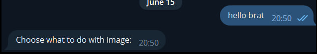
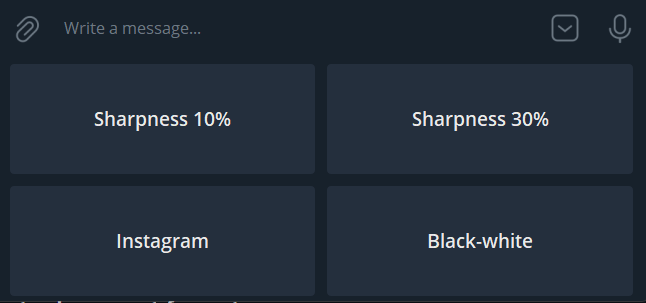
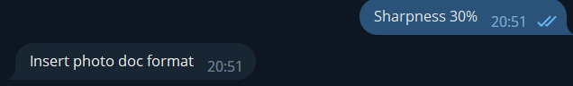

# Telegram bot in **c#** changing a photo

## Srart
To start the bot, you need to write ___"hello brat"___

The bot will reply ___"Choose what to do with image:"___

<h2>Change the photo</h2>

You need to choose using the buttons how you want to change the photo.

You can:
+ Sharpness 10%
+ Sharpness 30%
+ Instagram filter
+ Black-white

## Send photo document format

This telegram bot only works with doc

<h2>Result</h2>

Bot redone picture.

<h1>P.S</h1>

Telegram bot uses adobe photoshop to work, so if I just run it on my computer, make sure that Photoshop is downloaded.
